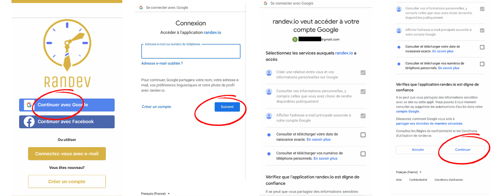
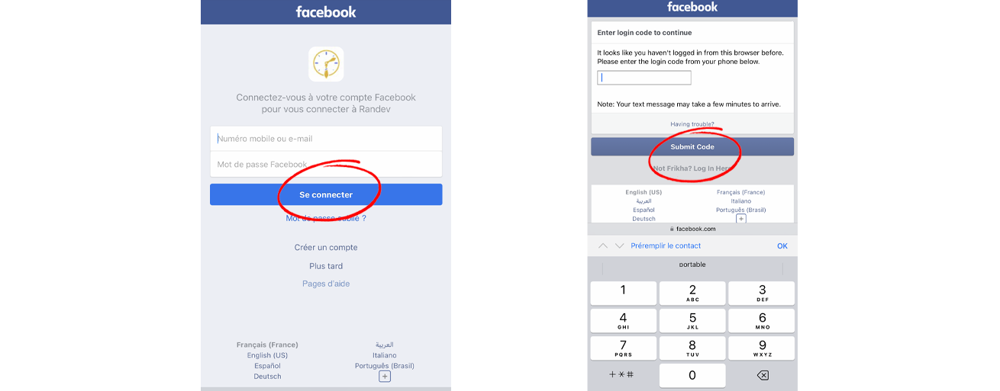
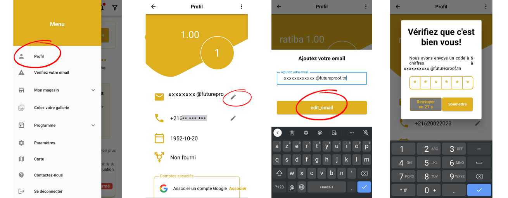
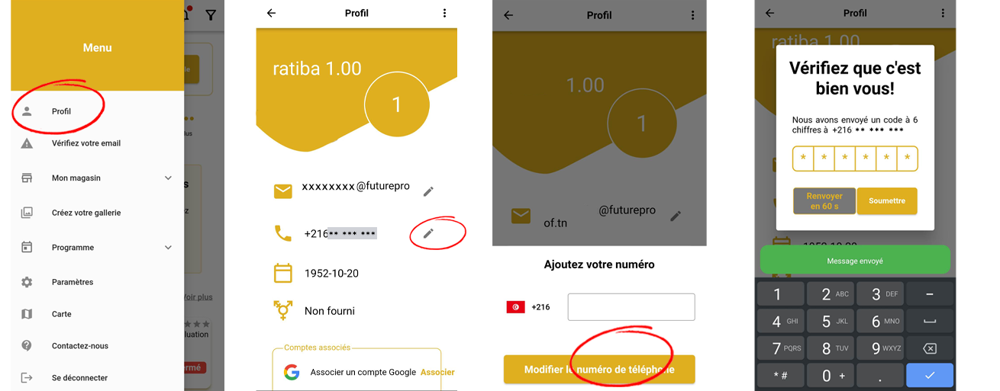
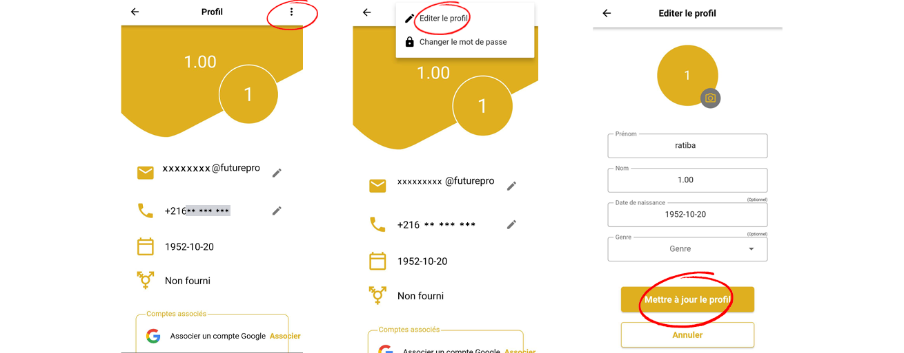

# Prise en main rapide

## Création de compte
Pour créer un compte, cliquez sur le bouton "creer un compte" et suivez les instructions. Vous devrez fournir votre nom, votre adresse e-mail et créer un mot de passe. Une fois votre compte créé, vous pourrez commencer à utiliser l'application.
### Moyennant d'un email et mot de passe

1-Ouvrir le menu.

2-Cliquer sur connexion.

3-Cliquer sur creer un compte.

(Vous avez le choix de vous connecter avec votre
compte google ou facebook)

4-Entrer vos informations personelles.

5-Cliquer sur creer un compte.

<figure markdown> 
  .png){ width="700" }
  <figcaption></figcaption>
</figure>

### En utilisant Google
Vous pouvez vous connecter a travers de votre compte google en indiquant votre adresse e-mail ou votre 
numero de telephone et votre mot de passe .

<figure markdown> 
  { width="700" }
  <figcaption></figcaption>
</figure>

### En Utilisant Facebook

Vous pouvez vous connecter a travers de votre compte Facebook en indiquant votre adresse e-mail ou votre 
numero de telephone et votre mot de passe ainsi que le code de verification .

<figure markdown> 
  { width="700" }
  <figcaption></figcaption>
</figure>

## Vérification de l'adresse email
Vous pouvez verifier ou modifier votre adresse e-mail.
Nous nous connectons au serveur de messagerie pour confirmer la validité de l'adresse e-mail que vous cherchez.
Vous recevez un code de confirmation par mail dans quelques instants .

<figure markdown> 
  { width="700" }
  <figcaption></figcaption>
</figure>

## Vérification du numéro de téléphone
Vous pouvez verifier ou modifier votre numero de telephone.
Nous nous connectons au serveur de messagerie pour confirmer la validité du numero que vous cherchez.
Vous recevez un code de confirmation par message dans quelques instants .

<figure markdown> 
  { width="700" }
  <figcaption></figcaption>
</figure>

## Modification des information de profil de l'utilisateur
Si vous souhaitez modifier les informations de profil de votre compte utilisateur dans Randev, voici les étapes à suivre :

Accédez à la section "Profil" de l'application où vous pouvez consulter et modifier les informations de votre compte.

Recherchez les champs que vous souhaitez modifier, tels que votre nom, votre adresse e-mail, votre numéro de téléphone, etc.

Cliquez sur le champ que vous souhaitez modifier et apportez les modifications nécessaires.

Vérifiez que toutes les informations sont correctes avant de valider les modifications.

Enregistrez les modifications en cliquant sur le bouton "mettre a jours".
<figure markdown> 
  { width="700" }
  <figcaption></figcaption>
</figure>

### Association d'un compte google ou facebook
Si vous souhaitez associer un compte Google ou Facebook à votre compte utilisateur dans Randev,

Recherchez la section "Profil" de l'application où vous pouvez modifier les informations de votre compte.

Recherchez l'option "Associer un compte" et choisissez Google ou Facebook.

Si vous n'êtes pas déjà connecté à votre compte Google ou Facebook, suivez les instructions pour vous connecter.

Donnez l'autorisation à l'application pour accéder à votre compte Google ou Facebook en cliquant sur le bouton "Autoriser".
<figure markdown> 
  { width="700" }
  <figcaption></figcaption>
</figure>

### Mise à jour de la photo de profil
Recherchez la section "Profil" de l'application où vous pouvez consulter et modifier les informations de votre compte.

Cliquez sur la photo de profil actuelle pour accéder à l'option de modification.

Vous pouvez maintenant choisir de télécharger une nouvelle photo à partir de votre appareil ou de prendre une photo en temps réel en utilisant votre caméra.

Sélectionnez la photo que vous souhaitez utiliser comme nouvelle photo de profil et ajustez-la si nécessaire.

Vérifiez que la nouvelle photo de profil est correctement cadrée et que l'orientation est correcte.

Enregistrez la nouvelle photo de profil en cliquant sur le bouton de confirmation .
<figure markdown> 
  { width="700" }
  <figcaption></figcaption>
</figure>