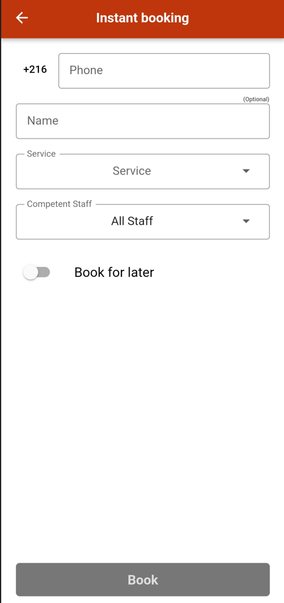

# دليل العمال

هل أنت عامل في متجر؟ هذا الدليل موجهٌ لك لتستعمل تطبيق رندف.

اتبع الخطوات التالية وستتمكن من الاستمتاع باستخدام رندف في أي وقت من الأوقات.

## دعوة صاحب المتجر

لكي تصبح عاملا في أحد المتاجر ، عليك الحصول على دعوة من مالك المتجر أولاً والتي ستظهر في قسم الإشعارات. يمكنك قبول الدعوة أو رفضها.

للقيام بذلك، تحتاج إلى:

- فتح تطبيق رندف

- النقر فوق رمز الإشعار في أعلى اليسار

- اختيار قبول العرض أو رفضه

## الحجز الفوري

أحد حرفائك لا يمتلك تطبيق رندف؟ يمكنك استعمال خاصية الحجز الفوري لكي تقوم بالحجز له

للقيام بذلك:

- افتح تطبيق رندف

- انقر على أيقونة القائمة
  - انقر على متجري ثم الحجز الفوري
  - يمكنك اختيار الحجز الأني أو في يوم اخر

للحجز في يوم اخر:

- اضغط على الزر احجز لوقت اخر في أسفل الصفحة
- اضغط على اليوم
- اضغط على الوقت المناسب
- اضغط على حجز

  

## إدارة المواعيد

يحتاج العمال إلى الحصول على معلومات كاملة حول موعد الحجوزات والأشخاص.

### تحقق من جدول المواعيد الخاص بي

كن على اطلاع دائم بالحجوزات القادمة.

جدول المواعيد هو ميزة مهمة تسهل تنظيم الوقت للعمال.

للتحقق من جدول المواعيد الخاص بك:

- تحتاج إلى فتح تطبيق رندف
- النقر فوق رمز القائمة
- النقر فوق البرنامج
- النقر فوق جدول عملي

  

يمكنك تغيير طريقة ظهور المعلومات عن طريق الضغط على الزر في أعلى اليسار

  

للاتصال بحريف أو ارسال رسالة له يمكنك النقر على الأيقونة المناسبة لفعل ذلك

  

