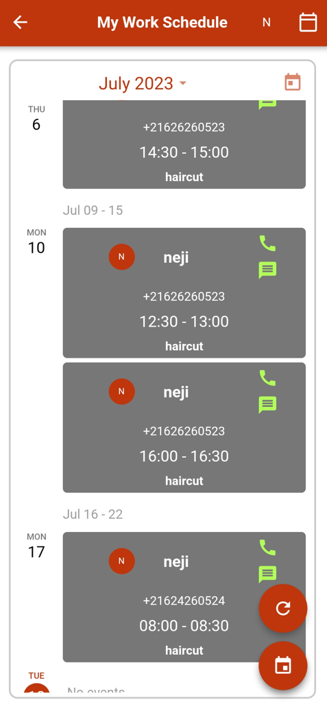

# Guide de l'employé

Bienvenue dans le guide de l'employé ! Ce guide est conçu pour vous afin de mieux comprendre ce que vous pouvez faire avec cette application.

## Invitation du propriétaire du magasin

Pour devenir un membre du personnel d'une boutique, le propriétaire doit vous envoyer une invitation au préalable. Vérifiez la cloche barre de notification en haut de l'écran pour accéder à l'invitation. Vous aurez alors le choix de :

Accepter l'invitation : vous devenez alors un membre de staff confirmé, votre interface changera pour vous donner l'accès à votre boutique.

Refuser l'invitation : rien ne changera pour vous et aucun lien ne sera effectué entre votre compte et le magasin duquel vous avez reçu l'invitation.

<figure markdown>
  { width="300" }
  <figcaption>Notification pour l'invitation du patron</figcaption>
</figure>

## Réservation instantanée

Pour faire une réservation instantanée :

- Ouvrez le menu déroulant
- Sélectionnez la section "Mon magasin"
- Sélectionnez "Réservation instantanée"
- Entrez le numéro de téléphone de votre client
- Entrez le nom de votre client (optionnel)
- Sélectionnez le service que vous souhaitez offrir
- Cliquez sur le bouton de réservation qui contient en fait la première date disponible pour le service sélectionné

  Randev vous offre encore plus de flexibilité pour réserver des intervalles de temps futures. Pour ce faire il vous suffit de

- Activer le bouton "Réserver plus tard"
- Le calendrier sera alors affiché
- Consultez les intervalles de temps dans tous les jours à venir
- Cliquez sur "Réserver"

<figure markdown>
  { width="300" }
  <figcaption>Réservation instantanée</figcaption>
</figure>

<figure markdown>
  {height: 600}
  <figcaption>Réservation instantanée</figcaption>
</figure>

## Consulter les réservations

Vous pouvez consulter vos réservations à tout moment et vérifier quand vous êtes libre et quand vous avez un travail à faire.

### Consulter mon calendrier

Vous pouvez accéder à votre calendrier et voir toutes vos réservations.

Pour faire ceci :

- Ouvrez l'application Randev
- Cliquez sur l'icône du menu déroulant
- Cliquez sur "Programme"
- Cliquez sur "Mon emploi du temps"

<figure markdown>
  { width="300" }
  <figcaption>Consulter mon calendrier</figcaption>
</figure>

<figure markdown>
  {height: 600}
  <figcaption>Consulter mon calendrier</figcaption>
</figure>

Vous pouvez changer l'affichage des rendez-vous en cliquant sur le bouton en haut à droite de la page.

<figure markdown>
  { width="300" }
  <figcaption>Appeler ou envoyer un message</figcaption>
</figure>

Vous pouvez appeler ou envoyer un message au client en cliquant sur l'icône qui convient à votre besoin.
