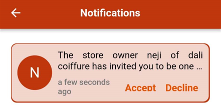
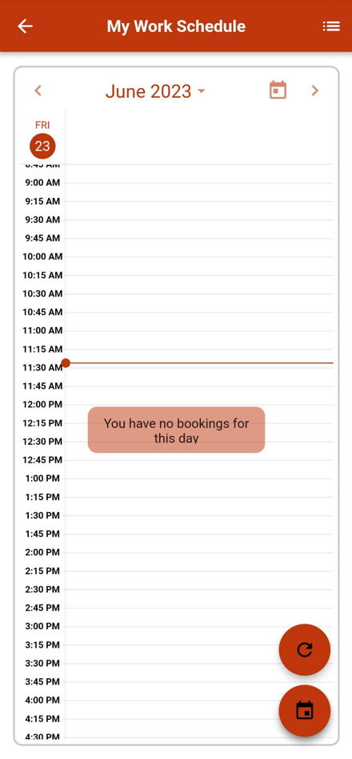
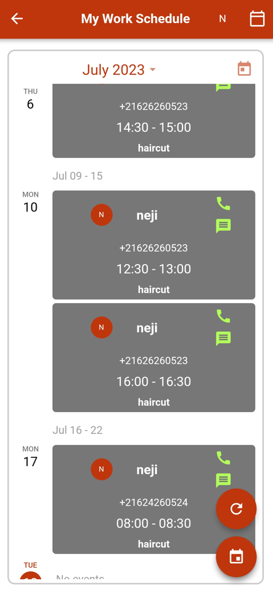
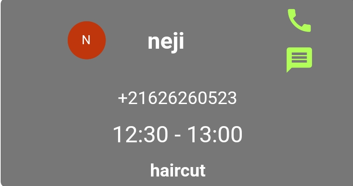

# Store staff guide

Welcome to Randev. In this guide, we will show you the purpose of each section as a staff member.

Follow these steps to quickly get acquainted with Randev.

## Store owner invitation

To become a staff member in a store, you need a store owner invitation. You will receive this invitation in your notification section, where you can accept or decline it.

To proceed:

- Open the Randev application.
- Click on the notification icon in the top right corner.
- Choose one of the following:
    - Accept the invitation: This confirms your staff membership and grants access to the store.
    - Decline the invitation: No changes will occur, and you won't be linked to the inviting store.

  

## Instant booking

When a client arrives without a booking or isn't a Randev user, you can instantly make a booking for them.

To do this:

- Open the Randev application.
- Click on the dropdown menu icon.
- Select "My Store."
- Choose "Instant Booking."
- Enter the client's phone number.
- Optionally, enter the client's name.
- Select the desired service.
- Click "Book" to select the first available time slot.

You can also choose a different date:

- Click on the "Book for Later" button.
- Choose the date.
- Select the timeslot.
- Click "Book."

  

## Manage bookings

For effective time management and to avoid double bookings or last-minute cancellations, staff members need comprehensive information about upcoming bookings.

### Check my calendar

Stay updated on your upcoming bookings for the day and beyond with the calendar feature, vital for efficient time organization.

To check your calendar:

- Open the Randev application.
- Click on the dropdown menu icon.
- Select "Agenda."
- Choose "My Work Schedule."
- Click on a booking to view more details.

  

You can adjust the page layout by clicking the button in the top right corner.

  

You can directly call or message the client by clicking on the respective icons.

  

