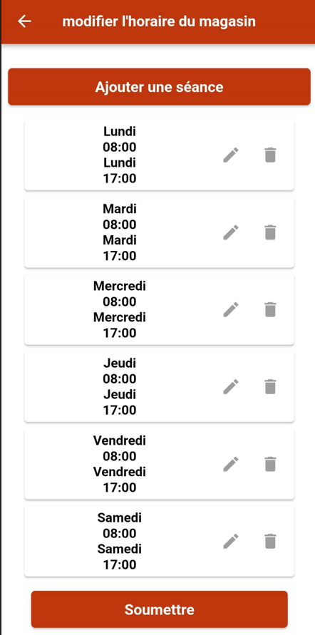
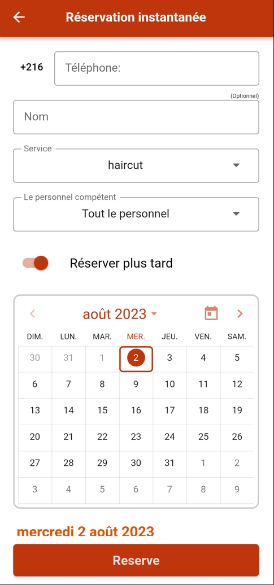
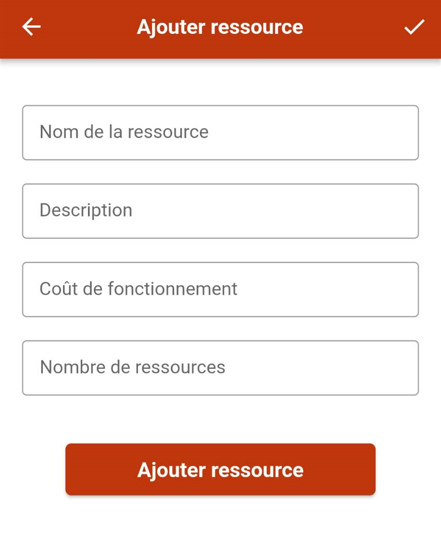

# Guide du propriétaire

Bienvenue dans le monde des propriétaires de Randev. Voici un guide pour vous initier !

## Vérifier votre téléphone

Commencez par vous assurer que votre téléphone est vérifié. Si ce n'est pas le cas :

- Cliquez sur le menu déroulant
- Cliquez sur "Ajouter votre numéro"
- Écrivez le numéro
- Cliquez sur "Soumettre"
- Consultez votre messagerie SMS
- Entrez le numéro de l'SMS
- Cliquez sur "Confirmer"

## Créer une boutique

Pour accéder à la page de création de la boutique, vous devez :

- Ouvrir le menu
- Cliquer sur le titre "Créer une boutique"

  

Vous devez fournir :

- Le nom de votre boutique : il servira d'enseigne pour votre boutique en ligne
- Vos domaines d'activité : cliquez sur la liste déroulante pour choisir un ou plusieurs domaines d'activité
- Votre téléphone
- Votre email
- L'adresse de votre boutique : utilisez la carte pour la fournir, ainsi votre boutique sera visible sur les résultats de recherches à travers la carte géographique
- Votre site web : ce champ est totalement optionnel

  

## Mise en place de l'emploi du temps du magasin

Le calendrier vous permet de définir votre emploi du temps pour la semaine. Il vous offre une flexibilité pour définir plusieurs sessions de travail pour chaque jour en déterminant les temps d'ouverture et de fermeture de votre boutique. Pour ajouter une session :

- Cliquez sur l'icône du menu déroulant
- Cliquez sur "Mon magasin"
- Cliquez sur "Emploi du temps"
- Cliquez sur "Ajouter une séance"
- Fournissez l'heure de début et l'heure de fin de la session
- Cliquez sur "Soumettre"

<b> Note : Vous pouvez copier la session des jours précédents dans le cas où vous avez le même horaire de travail pendant plusieurs jours, ceci vous évitera de donner la même information plusieurs fois </b>

  

  

## <h2 id="réservation instantanée"> Réservation instantanée </h2>

C'est une fonctionnalité qui permet aux prestataires de service de réserver immédiatement un service à un client lorsque le client n'a pas l'application Randev.

Pour faire ceci, vous devez :

- Cliquez sur l'icône du menu déroulant
- Cliquez sur "Mon magasin"
- Cliquez sur "Réservation instantanée"
- Entrez le numéro de téléphone de votre client
- Entrez le nom de votre client (optionnel)
- Sélectionnez le service que vous souhaitez offrir
- Sélectionnez le membre du staff qui va fournir le service
- Cliquez sur le bouton de réservation qui contient la première date disponible pour le service sélectionné

Randev vous offre encore plus de flexibilité pour réserver des intervalles de temps futurs. Pour faire ceci, il vous suffit de :

- Activer le bouton "Réserver plus tard"
- Le calendrier sera alors affiché
- Consultez les intervalles de temps dans tous les jours à venir
- Cliquez sur "Réserver"

  

## Consulter mon calendrier

Pour ouvrir votre calendrier, vous devez :

- Cliquez sur "Mon emploi du temps" dans la page d'accueil

Vous pouvez voir l'emploi du temps de votre staff ou bien de la section "no staff" pour les services sans staff.

  

Vous pouvez changer l'affichage des rendez-vous en cliquant sur le bouton en haut à droite de la page.

  

Vous pouvez appeler ou envoyer un message au client en cliquant sur l'icône correspondante.

  

### Vérifier le calendrier du personnel

Vous pouvez aussi accéder au calendrier d'un employé en cliquant sur l'icône du profil. La liste de tous vos employés va s'afficher et là vous pouvez choisir lequel vous voulez consulter.

  

### Annuler la réservation

Si vous avez besoin de supprimer un événement existant, cliquez sur l'événement correspondant dans votre calendrier et supprimez-le.

Pour faire ceci, vous devez :

- Cliquez sur l'icône du menu déroulant
- Cliquez sur "Programme"
- Cliquez sur "Les rendez-vous"
- Cliquez sur l'icône de suppression

  

## Gestion du personnel

La liste des employés est composée de 3 sections :

- Confirmé : une section qui contient les membres du personnel qui ont déjà accepté votre invitation.
- En attente : une section qui contient les membres que vous avez ajoutés et qui n'ont pas encore accepté votre invitation.
- Supprimé : une section qui contient les membres du personnel que vous avez supprimés.

  

### Ajouter du personnel à votre magasin

Vous êtes propriétaire d'un magasin et vous souhaitez ajouter du personnel à votre équipe. Pour ajouter un employé :

- Cliquez sur l'icône du menu déroulant
- Cliquez sur "Mon magasin"
- Cliquez sur "Membres du staff"
- Cliquez sur le bouton "Ajouter un employé" et entrez son nom et ses informations de contact.

  

### Suppression de personnel de votre magasin

Pour faire ceci, vous devez :

- Cliquez sur le menu déroulant
- Cliquez sur "Mon magasin"
- Cliquez sur "Membres du staff"
- Cliquez sur l'icône de suppression

## Gestion des ressources

Vous pouvez accéder à toutes les ressources que vous avez ajoutées. Si vous avez besoin de modifier ou supprimer une ressource existante, cliquez sur le bouton de suppression ou de modification correspondant pour apporter les modifications nécessaires.

Pour faire ceci, vous devez :

- Cliquez sur l'icône du menu déroulant
- Cliquez sur "Mon magasin"
- Cliquez sur "Ressources matérielles"

  

### Ajouter des ressources matérielles

Déterminez les ressources que vous devez gérer dans votre boutique. Par exemple, vous pourriez avoir besoin de gérer des produits, des équipements...

Pour faire ceci, vous devez :

- Cliquez sur l'icône du menu déroulant
- Cliquez sur "Mon magasin"
- Cliquez sur "Ressources matérielles"
- Cliquez sur le bouton "plus"

  

  

### Supprimer des ressources matérielles

Pour faire ceci, vous devez :

- Cliquez sur l'icône du menu déroulant
- Cliquez sur "Mon magasin"
- Cliquez sur "Ressources matérielles"
- Cliquez sur l'icône de suppression

## Gestion des services

Vous pouvez accéder à tous les services que vous avez ajoutés. Si vous avez besoin de modifier ou supprimer un service existant, cliquez sur le bouton de suppression ou de modification correspondant pour apporter les modifications nécessaires.

Pour faire ceci, vous devez :

- Cliquez sur l'icône du menu déroulant
- Cliquez sur "Mon magasin"
- Cliquez sur "Les services"

  

### Ajouter un service

Pour ajouter un service, vous devez :

- Cliquez sur le bouton "plus"
- Remplissez les champs suivants :
  - Nom : Nommez votre service en fonction de ce qu'il fait. Le nom de vos services peut aider vos clients à trouver votre boutique dans les résultats de recherche.
  - Description : Ajoutez une description à votre service pour bien expliquer son utilité au client.
  - Prix : Mettez le prix que vous souhaitez pour fournir ce service.
  - Nombre d'employés : déterminez le nombre d'employés nécessaires pour fournir le service.
  - Durée : Introduisez la durée pour fournir le service en minutes.
  - Type de réservation : vous avez deux choix :
    1. Réservation directe : dans ce cas, un client peut effectuer autant de réservations qu'il veut pendant une journée.
    2. Réservation limitée : ce type de réservation signifie que le client a un nombre spécifique de fois qu'il peut réserver le service.
  - Limite de réservation : cette section ne s'active que pour le type de réservation "Réservation limitée", entrez le nombre maximal de réservations par jour. 
    <b> Note : Si vous choisissez une limite de réservation égale à zéro, le client ne pourra pas la réserver. Il doit vous contacter pour que vous effectuiez la réservation pour lui par la fonctionnalité de <a href ="#réservation instantanée"> réservation instantanée </a>.</b>
  - Nom de la ressource : Le nom de la ressource. Vous pouvez choisir des ressources qui ont déjà été créées.
  - Service désigné : si le service ne peut être fourni que par quelqu'un qui possède des compétences particulières.
    - Activer le bouton "Service désigné"
    - Sélectionner les membres du personnel qualifiés pour ce service.

  

### Suppression des services

Pour faire ceci, vous devez :

- Cliquez sur le menu déroulant
- Cliquez sur "Mon magasin"
- Cliquez sur "Les services"
- Cliquez sur l'icône de suppression
