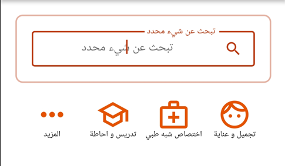
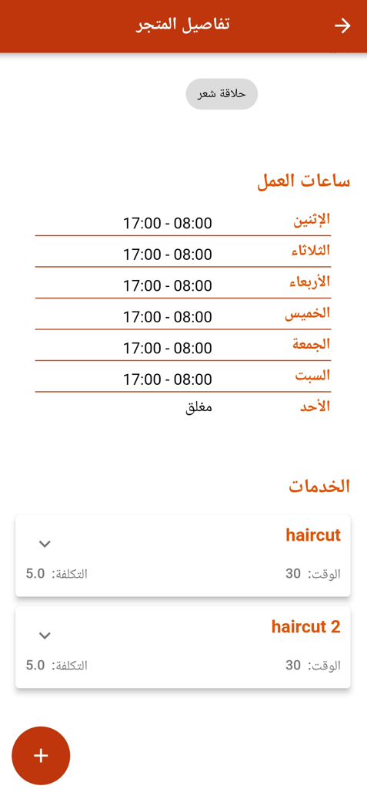
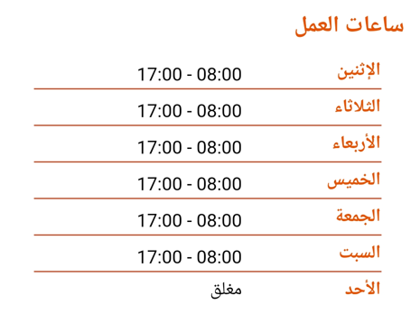
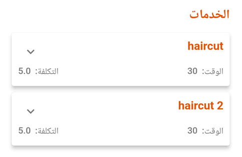
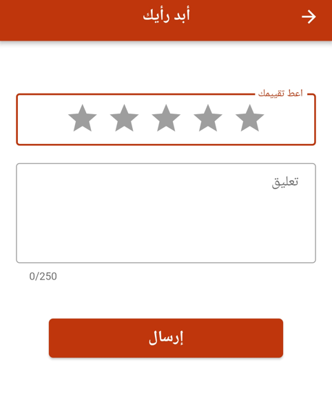
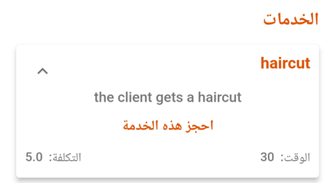
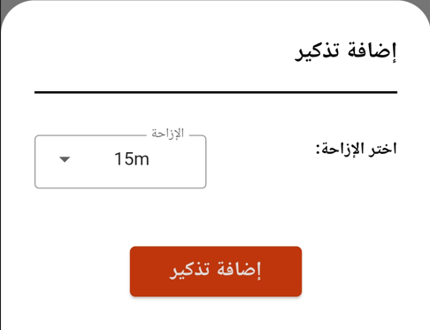
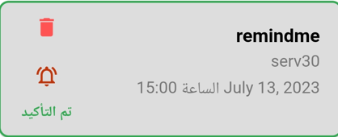

# دليل المستخدم

يوجد في هذا الدليل جميع المعلومات التي يحتاجها مستخدم تطبيق رندف للاستمتاع باستخدامه.

تم تصميم رندف لمساعدة المستخدم في كسب المزيد من المال والوقت.

سيوجه هذا الدليل المستخدم خطوة بخطوة لفهم كيفية عمل رندف وما فائدة كل قسم فيه.

## تسجيل الدخول

هناك عدة طرق لتسجيل الدخول إلى التطبيق.

أولاً عليك فتح التطبيق. ثم اضغط على أيقونة القائمة المنسدلة ثم اضغط على تسجيل الدخول.

بمجرد دخولك إلى صفحة تسجيل الدخول ، سترى عدة خيارات.
أول واحد منهم هو تسجيل الدخول باستخدام جوجل. بنقرة واحدة بسيطة ويتم تسجيل دخولك.

الخيار الثاني هو تسجيل الدخول باستخدام فايسبوك.

الخيار الأخير لتسجيل الدخول هو استخدام البريد الإلكتروني الذي يتطلب أن يكون لديك حساب بالفعل. إذا لم يكن لديك ، يمكنك استخدام خيار إنشاء حساب.

  

## البحث عن محلّ / مزوّد خدمة

إحدى الميزات التي يتمتع بها رندف هي البحث عن خدمات المتجر

- أولاً عليك فتح التطبيق
- ثم انقر ببساطة على زر البحث الموجود أعلى الصفحة.
- بعد ذلك اكتب اسم المتجر.

  

### البحث عن طريق الخرائط

يوفر تطبيقنا موقع المتجر الذي يملأه صاحب العمل عند إنشاء متجره.

للقيام بذلك تحتاج إلى

- فتح التطبيق
- والنقر فوق القائمة المنسدلة
- ثم الضغط على الخريطة .

  

### البحث المتقدّم

إذا كنت تبحث عن فئة معينة فنحن نوفر لك معايير تساعدك على البحث

للقيام بذلك ، انقر فوق رمز التصفية في أعلى يسار الصفحة.

  

## التثبّت من معطيات محل/مزوّد خدمة

يحتوي كل متجر على تفاصيل متعددة. يمكن أن تساعد هذه التفاصيل الحريف في تحديد ما إذا كان يحتاج إلى الإنتفاع بالخدمة بواسطة هذا المتجر أم لا.

للقيام بذلك يحتاج الحريف إلى

- فتح تطبيق رندف
- ثم الضغط على بطاقة المتجر التي يريد التحقق من تفاصيلها.

  

### التحقق من مواعيد العمل

هذه الميزة تجعل الحجوزات أسهل لكل من المالك والحريف. حيث يوفر للأول جلسات العمل الخاصة به ليجدها الحريف في رندف دون الحاجة إلى الذهاب فعليًا إلى المتجر.

يجد الحريف هذه التواقيت في صفحة تفاصيل المتجر.

  

### التحقق من الخدمات

تتيح هذه الميزة للعميل الاطلاع على جميع الخدمات التي يقدمها المتجر. يمكن أن يكون للمتجر خدمات متعددة

للقيام بذلك ، يحتاج الحريف إلى

- فتح تطبيق رندف،
- النقر فوق بطاقة المتجر التي يريد التحقق منها
- والتنقل للأسفل إلى الخدمات.

  

## إضافة مراجعة المتجر

لتقييم المتجر عليك

- فتح تطبيق رندف ،
- والنقر على بطاقة المتجر التي تريد مراجعتها ،
- والنقر على أيقونة النجوم ،
- ثم إعطاء تقييمك الخاص مع تعليق إذا أردت وإرساله.

  

## إجراء الحجز

تتيح جميع الميزات المذكورة أعلاه للعميل في النهاية إجراء الحجز. هذه هي الميزة المحورية للتطبيق. يتحقق الحريف من جميع المعلومات الواردة أعلاه ثم يقرر متى وأين يقوم بالحجز.

- وللقيام بذلك يحتاج الحريف إلى الوصول إلى صفحة تفاصيل المتجر
- ثم الضغط على الخدمة التي يحتاجها
- ثم الضغط على حجز هذه الخدمة.

  

## إضافة تذكير للحجز

بعد إجراء الحجز ، قد تحتاج إلى تذكير حتى لا تنساه.

للقيام بذلك ، تحتاج إلى

- فتح تطبيق رندف ،
- النقر على القائمة المنسدلة في الجزء العلوي من الصفحة.
- بعد ذلك الضغط على البرنامج
- وأخيراً مواعيدي. ستجد في هذا القسم جميع حجوزاتك .

يمكنك حذف حجز أو إضافة تذكير بمجرد النقر على أيقونة الجرس.

  

## إزالة تذكير للحجز

مثلما يمكنك إضافة تذكير للحجز ، يمكنك إزالة واحد.

للقيام بذلك ،

- تحتاج إلى فتح تطبيق رندف ،
- النقر فوق القائمة المنسدلة في الجزء العلوي من الصفحة.
- بعد ذلك الضغط على البرنامج
- وأخيراً مواعيدي. ستجد في هذا القسم جميع حجوزاتك.

انقر فوق رمز الجرس وستظهر نافذة تحتوي على أيقونات تغيير وحذف.

  

