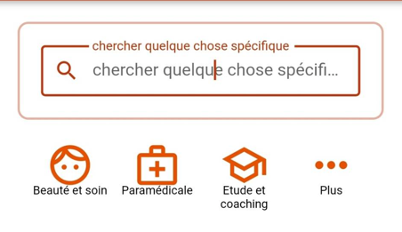
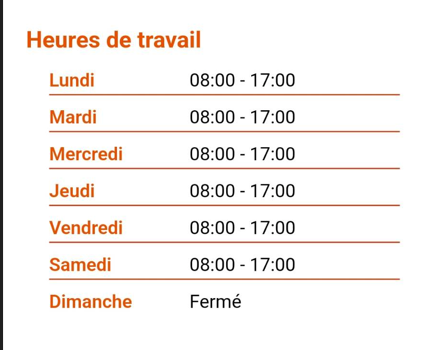
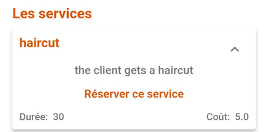
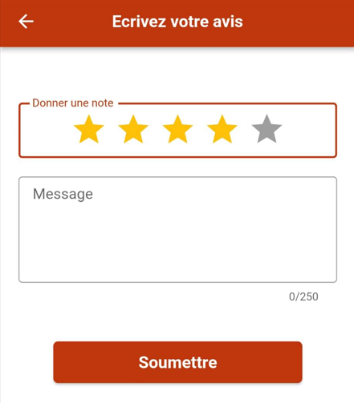
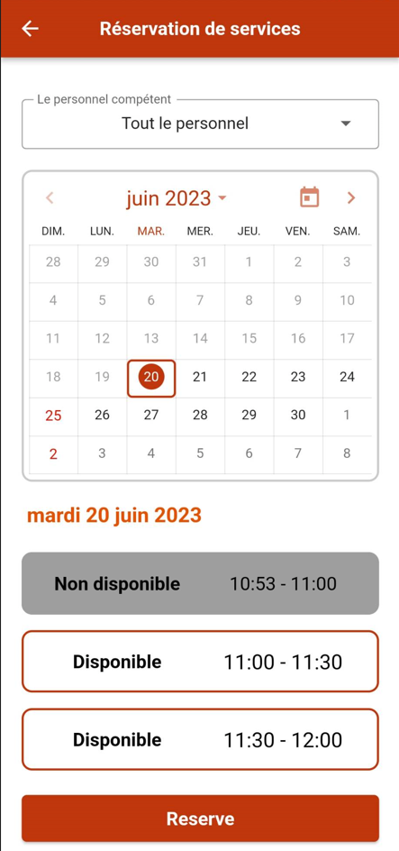
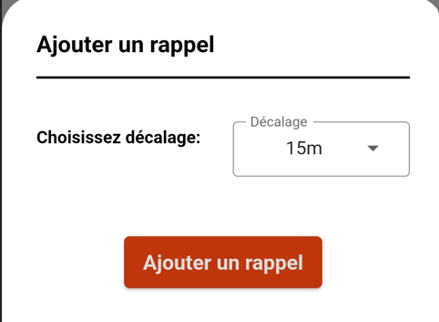
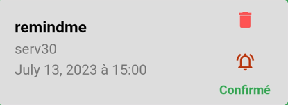

# Guide de l'utilisateur

Bienvenue sur notre guide de l'utilisateur pour l'application Randev ! Nous sommes là pour vous aider à vous familiariser avec les différentes fonctionnalités de l'application et vous guider tout au long de votre expérience utilisateur.

Pour commencer, voici les étapes à suivre pour utiliser l'application :

## Créer un compte

Pour utiliser Randev, il faut créer un compte. Voici comment :

- Ouvrir l'application
- Cliquer sur l'icône du menu déroulant
- Cliquer sur "Créer un compte"

    1.  Remplir les informations requises : email, mot de passe, prénom, nom, numéro de téléphone
    2.  Cliquer sur 'Créer un compte'
    3.  Entrer le code reçu par SMS

  Félicitations, vous êtes désormais un utilisateur Randev !

<figure markdown>
  {height: 600}
  <figcaption>Création d'un compte</figcaption>
</figure>
 

## Connexion avec un compte d'utilisateur

Il existe plusieurs façons de se connecter à l'application.

Voici trois méthodes :

### Connexion avec Google
- Ouvrir l'application
- Ouvrir le menu déroulant
- Cliquez sur "Continuer avec Google"

<figure markdown>
  {height: 600}
  <figcaption>Connexion avec Google</figcaption>
</figure>

### Connexion avec Facebook
- Ouvrir l'application
- Ouvrir le menu déroulant
- Cliquez sur "Continuer avec Facebook"
### Connexion avec un compte existant
- Ouvrir l'application
- Ouvrir le menu déroulant
- Cliquez sur "Continuer avec email" (vous devez avoir déjà créé un compte)
  
  

<figure markdown>
  {height: 600}
  <figcaption>Connexion avec un compte existant</figcaption>
</figure>

## Recherche de boutique / service

Notre application vous permet de rechercher n'importe quelle boutique ou service que vous souhaitez.

### Recherche rapide

- Ouvrir l'application
- Accéder à l'onglet "Recherche" dans le menu principal
- Tapez le nom de la boutique ou du service dans la barre de recherche.

<figure markdown>
  { width="300" }
  <figcaption>Recherche</figcaption>
</figure>

<figure markdown>
  {height: 600}
  <figcaption>Recherche rapide</figcaption>
</figure>

### Localisation de la boutique sur la carte

Si vous le souhaitez, vous pouvez également voir la localisation de la boutique sur la carte.

Pour faire ceci :

- Ouvrir l'application Randev
- Cliquer sur l'icône du menu déroulant
- Cliquer sur "Carte"

<figure markdown>
  { width="300" }
  <figcaption>Localisation de la boutique</figcaption>
</figure>

<figure markdown>
  {height: 600}
  <figcaption>Recherche par carte</figcaption>
</figure>

### Recherche avancée

Pour accéder à la recherche avancée, utilisez les différents critères de recherche disponibles pour affiner vos résultats.

- Ouvrir l'application Randev
- Cliquer sur l'icône de filtre en haut de la page

Vous pouvez utiliser des filtres tels que la localisation, le prix, le rayon, la position. Une fois que vous avez défini les critères, cliquez sur "Rechercher" pour lancer la recherche avancée.

<figure markdown>
  { width="300" }
  <figcaption>Recherche avancée</figcaption>
</figure>

<figure markdown>
  {height: 600}
  <figcaption>Recherche avancée</figcaption>
</figure>

## Consulter les détails de la boutique

Vous pouvez cliquer sur chaque résultat pour en savoir plus sur la boutique ou le service, notamment l'adresse, les horaires d'ouverture, les services et les avis des utilisateurs.

### Horaires d'ouverture de la boutique

Vous pouvez trouver les horaires d'ouverture de la boutique pour planifier vos visites et rendez-vous.

<figure markdown>
  { width="300" }
  <figcaption>Horaires de travail</figcaption>
</figure>

<figure markdown>
  {height: 600}
  <figcaption>Horaires de travail</figcaption>
</figure>

### Services de la boutique

Vous pouvez trouver les services proposés par la boutique et profiter de ce qu'elle a à offrir.

<figure markdown>
  { width="300" }
  <figcaption>Services</figcaption>
</figure>

## Ajout d'un avis d'utilisateur

Vous pouvez partager votre avis et aider à améliorer la qualité des services. Choisissez une note ou une évaluation pour le produit ou le service.

<figure markdown>
  { width="300" }
  <figcaption>Avis</figcaption>
</figure>

<figure markdown>
  {height: 600}
  <figcaption>Avis</figcaption>
</figure>

## Effectuer une réservation

Vous pouvez réserver des services proposés dans l'application.

- Sélectionnez le service
- Choisissez la personne qui vous offre le service (optionnel)
- Sélectionnez la date et l'intervalle de temps
- Cliquez sur "Réservez"
- Confirmez votre choix dans la pop-up

<figure markdown>
  { width="300" }
  <figcaption>Effectuer une réservation</figcaption>
</figure>

<figure markdown>
  {height: 600}
  <figcaption>Effectuer une réservation</figcaption>
</figure>

## Ajouter un rappel pour une réservation

Ajoutez un rappel pour ne pas manquer votre réservation.

- Accédez à la page "Mes rendez-vous"
- Cliquez sur la cloche sur la carte de réservation
- Choisissez le délai du rappel
- Cliquez sur "Ajouter un rappel"

Vérifiez les informations et appuyez sur "Ajouter".

<figure markdown>
  { width="300" }
  <figcaption>Ajouter un rappel</figcaption>
</figure>

<figure markdown>
  {height: 600}
  <figcaption>Ajouter un rappel</figcaption>
</figure>

## Suppression d'un rappel pour une réservation

Pour supprimer un rappel :

- Accédez à la page "Mes rendez-vous"
- Sur la carte de réservation, cliquez sur la cloche
- Cliquez sur l'icône de suppression
- Confirmez

<figure markdown>
  { width="300" }
  <figcaption>Supprimer un rappel</figcaption>
</figure>

<figure markdown>
  {height: 600}
  <figcaption>Supprimer un rappel</figcaption>
</figure>
