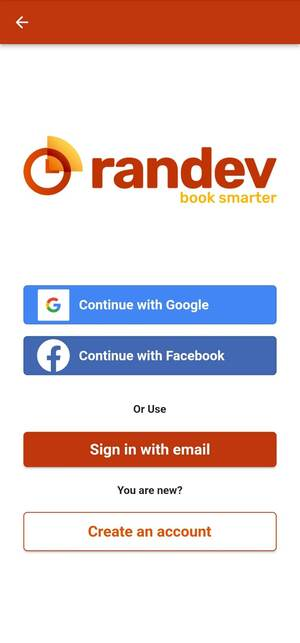
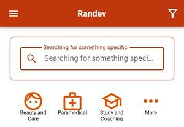
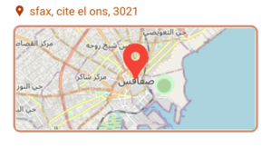
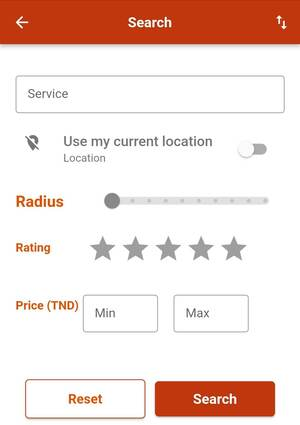
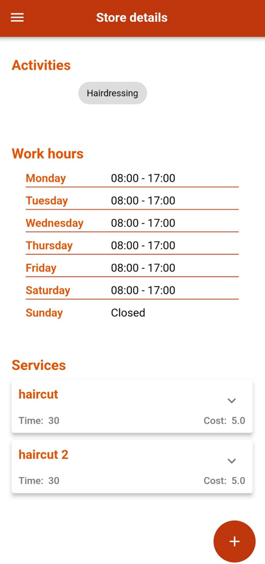
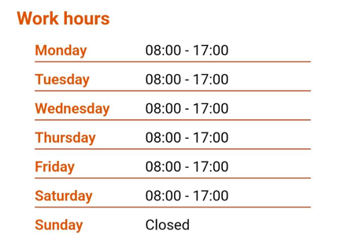
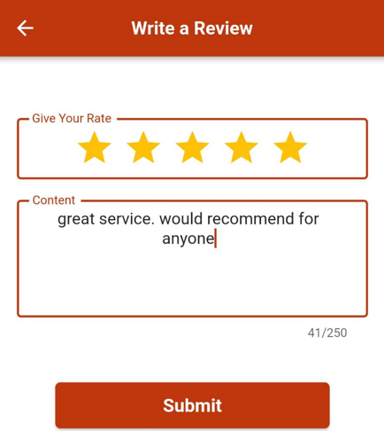
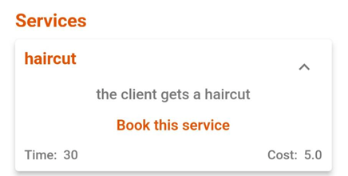
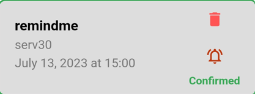

# User guide

In this guide, you will find all the information you need to make the most of the Randev application and enhance your user experience.

Randev is designed to help you maximize profits and minimize time loss. This guide will take you through each step to understand how Randev works and the purpose of each section.

## Sign up

To start using our application, you need to create an account.

- First, open the application.
- Click on the menu dropdown icon.
- Click on "Create an account."
  1.  Provide your email.
  2.  Choose a password.
  3.  Enter your surname and name.
  4.  Verify your phone number with an SMS containing a 6-digit code.
  5.  Optionally, provide your birthdate.

## Logging in to the application

There are three ways to log in to the application.

- Login with Google

    - Open the Randev application.
    - Click on the dropdown menu icon.
    - Click on "Login."
    - Click on "Continue with Google."

- Login with Facebook

    - Open the Randev application.
    - Click on the dropdown menu icon.
    - Click on "Login."
    - Click on "Continue with Facebook."

- Login with an account

    - Open the Randev application.
    - Click on the dropdown menu icon.
    - Click on "Login."
    - Click on "Continue with email." You need to have already created an account as shown in the previous section. Enter the correct email and password.

  

## Searching for a store

One of the exciting features of Randev is the store search feature.

### Quick search

- Open the application.
- Click on the search button at the top of the page.
- Type in the name of the store.

  

### Locating the store on the map

Our application provides the exact location of the store as provided by the business owner.

To check the store location:

- Open the Randev application.
- Click on the dropdown menu icon.
- Click on "Map."

  

### Refining the search criteria

For more advanced options beyond searching by name or service, use the advanced search feature with additional criteria.

To access the advanced search:

- Open the Randev application.
- Click on the filter icon at the top right of the page.

  

## Checking out store details

Each store has various details provided by the owner upon creation. These details help clients decide whether to use the store's services.

To check store details:

- Open the Randev application.
- Click on the store card to view details.

  

### Checking out the opening times

Find store opening times on the store details page, making booking convenient for both the owner and the client.

  

### Checking out the services

Discover the services offered by the store, enabling you to take advantage of everything it offers.

  

## Adding a store review

Share your thoughts to improve service quality by leaving a review with a star rating and comments.

  

## Performing a booking

All the previous features lead up to the main action: making a booking. After checking details, clients decide when and where to book.

To make a booking:

- Access the store details page.
- Click on the desired service.
- Click on "Book this service."

  - Select a staff member.
  - Choose a day.
  - Pick an available time slot.
  - Click the "Book" button.
  - Confirm or cancel the booking in the popup.

  

## Adding a reminder for a booking

After making a booking, add a reminder to ensure you don't forget.

To add a reminder:

- Open the Randev application.
- Click on the dropdown menu at the top.
- Click on "Agenda."
- Click on "My bookings."
- Manage your bookings, including adding a reminder by clicking the bell icon.

  

## Removing a reminder for a booking

You can also remove a reminder, just as you added one.

To remove a reminder:

- Open the Randev application.
- Click on the dropdown menu at the top.
- Click on "Agenda."
- Click on "My bookings."
- Click on the bell icon for the booking and choose to edit or delete.

  

